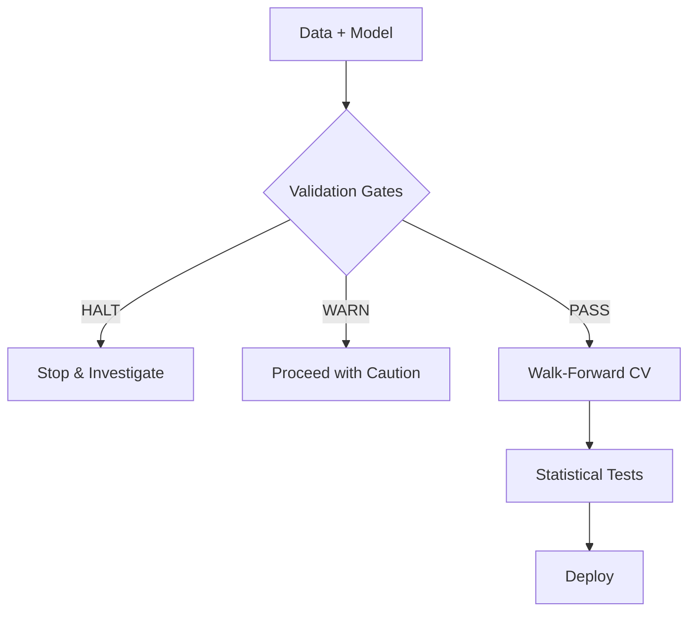

<p align="center">
  
</p>

<p align="center">
  <strong>Rigorous cross-validation for time series with leakage detection and gap enforcement.</strong>
</p>

<p align="center">
  <a href="https://github.com/brandonmbehring-dev/temporalcv/actions/workflows/ci.yml"></a>
  <a href="https://pypi.org/project/temporalcv/"></a>
  <a href="https://temporalcv.readthedocs.io"></a>
  <a href="https://pypi.org/project/temporalcv/"></a>
  <a href="docs/testing_strategy.md"></a>
  <a href="https://colab.research.google.com/github/brandonmbehring-dev/temporalcv/blob/main/notebooks/demo.ipynb"></a>
</p>

<p align="center">
  <a href="https://temporalcv.readthedocs.io">Documentation</a> •
  <a href="https://temporalcv.readthedocs.io/en/latest/auto_examples/">Examples</a> •
  <a href="https://temporalcv.readthedocs.io/en/latest/tutorials/leakage_detection.html">Leakage Tutorial</a>
</p>

---

## Installation

```bash
pip install temporalcv
```

## Quick Start

Validate your model for temporal leakage in 3 lines:

```python
from temporalcv import run_gates

report = run_gates(model, X, y)
print(report.status)  # HALT, WARN, or PASS
```

| Status | Meaning |
|--------|---------|
| **HALT** | Leakage detected — stop and investigate |
| **WARN** | Suspicious signal — proceed with caution |
| **PASS** | Validation passed — continue to CV |

---

## Why temporalcv?

Standard cross-validation shuffles data randomly. For time series, this means training on future data to predict the past — a form of data leakage that inflates metrics.

temporalcv provides:
- **Leakage detection** via validation gates (shuffled target test, suspicious improvement)
- **Gap enforcement** for h-step forecasting (no lag-feature contamination)
- **High-persistence metrics** (MASE, MC-SS) that measure actual skill

---

## Feature Comparison

| Feature | temporalcv | sklearn | sktime | darts |
|---------|:----------:|:-------:|:------:|:-----:|
| Gap enforcement | ✓ | ✗ | ✗ | ✗ |
| Leakage detection gates | ✓ | ✗ | ✗ | ✗ |
| Conformal prediction | ✓ | ✗ | Partial | ✓ |
| sklearn-compatible API | ✓ | ✓ | ✓ | ✗ |
| Statistical tests (DM, PT) | ✓ | ✗ | Partial | ✗ |

---

## Core Features

### Walk-Forward CV with Gap

```python
from temporalcv import WalkForwardCV

cv = WalkForwardCV(
    window_type="sliding",
    window_size=104,    # 2 years of weekly data
    horizon=2,          # 2-step ahead forecast
    test_size=1
)

for train_idx, test_idx in cv.split(X, y):
    model.fit(X[train_idx], y[train_idx])
    pred = model.predict(X[test_idx])
```

The `horizon` parameter enforces a gap between training and test sets, preventing lagged features from leaking target information.

### Validation Gates

```python
from temporalcv.gates import gate_signal_verification, gate_suspicious_improvement

gates = [
    gate_signal_verification(model, X, y, n_shuffles=100),
    gate_suspicious_improvement(model_mae, baseline_mae, threshold=0.20),
]

report = run_gates(gates)
if report.status == "HALT":
    raise ValueError(f"Leakage detected: {report.summary()}")
```

### High-Persistence Metrics

When your series is "sticky" (ACF(1) > 0.9), standard MAE lies — predicting "same as yesterday" looks great but adds no value.

```python
from temporalcv.metrics import mase, mc_skill_score

print(f"MASE: {mase(actual, predicted, y_train):.3f}")
print(f"MC-SS: {mc_skill_score(actual, predicted):.3f}")
```

| Metric | What It Measures |
|--------|------------------|
| **MASE** | Error relative to naive forecast (scale-free) |
| **MC-SS** | Skill only when target moved |

---

## Validation Pipeline



---

## Common Leakage Patterns

Learn from these failure modes:

| Pattern | Example | Why It's Bad |
|---------|---------|--------------|
| Rolling stats on full series | `.rolling().mean()` without `.shift()` | Features encode future |
| No gap for h-step forecast | `horizon=0` when predicting 2 steps ahead | Lag features leak target |
| Threshold on full data | Regime boundary uses all data | Classification cheats |

See the [failure examples gallery](examples/) for detailed walkthroughs:
- [16: Rolling Stats Leak](examples/16_failure_rolling_stats.py)
- [17: Threshold Leak](examples/17_failure_threshold_leak.py)
- [19: Missing Gap](examples/19_failure_missing_gap.py)
- [20: KFold Trap](examples/20_failure_kfold.py) — 47.8% fake improvement

---

## Optional Dependencies

```bash
pip install temporalcv[benchmarks]   # M4/M5 benchmarks
pip install temporalcv[changepoint]  # PELT algorithm
pip install temporalcv[dev]          # Testing, linting
pip install temporalcv[all]          # Everything
```

**Core**: numpy >= 1.23, scipy >= 1.9, scikit-learn >= 1.1, pandas >= 1.5

**Platforms**: Linux, macOS, Windows | **Python**: 3.9–3.12

---

## Documentation

| Resource | Description |
|----------|-------------|
| [Quickstart](https://temporalcv.readthedocs.io/en/latest/quickstart.html) | Get running in 5 minutes |
| [Leakage Tutorial](https://temporalcv.readthedocs.io/en/latest/tutorials/leakage_detection.html) | Deep dive on detection |
| [API Reference](https://temporalcv.readthedocs.io/en/latest/api/) | Full API docs |
| [Examples Gallery](https://temporalcv.readthedocs.io/en/latest/auto_examples/) | 21 real-world cases |

---

## Validation Evidence

| Test | Reference | Result |
|------|-----------|--------|
| DM test golden values | R `forecast::dm.test()` | ✓ Match |
| Type I error rate | 500 Monte Carlo sims | 5% ± 2% |
| Conformal coverage | Synthetic AR(1) | 95% nominal |
| Benchmark | M4 Competition (4,773 series) | ✓ Validated |

See [Testing Strategy](https://temporalcv.readthedocs.io/en/latest/testing_strategy.html) for details.

---

## Citation

```bibtex
@software{temporalcv2025,
  author    = {Behring, Brandon},
  title     = {temporalcv: Temporal cross-validation with leakage protection},
  year      = {2025},
  publisher = {GitHub},
  url       = {https://github.com/brandonmbehring-dev/temporalcv}
}
```

---

## Contributing

See [CONTRIBUTING.md](CONTRIBUTING.md) for development setup and guidelines.

## License

MIT License — see [LICENSE](LICENSE)
