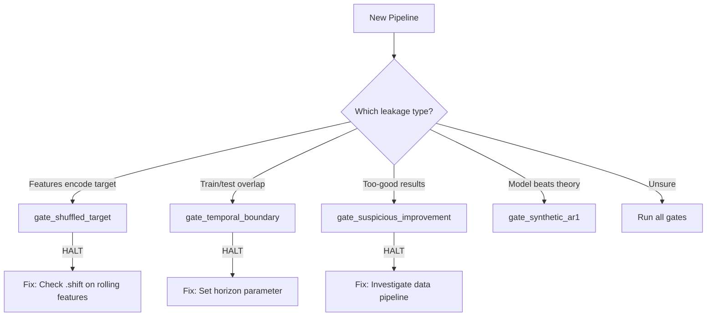

# API Reference: Validation Gates

Three-stage validation framework with HALT/PASS/WARN/SKIP decisions for leakage detection.

---

## When to Use



### Common Mistakes

- **Using `n_shuffles=10`** for permutation testing
  - Minimum p-value is 1/11 ≈ 0.09, can't detect leakage
  - Use `n_shuffles >= 100` for statistical power

- **Ignoring WARN status**
  - WARNs often precede HALTs in production
  - Always investigate WARNs before deployment

- **Running gates after training**
  - Gates should run *before* investing time in model development
  - Pattern: validate → develop → validate again

**See Also**: [Guardrails Tutorial](../tutorials/guardrails.md), [Example 16-20](../tutorials/examples_index.md#failure-cases)

---

## Enums

### `GateStatus`

Validation gate status enumeration.

| Value | Meaning |
|-------|---------|
| `HALT` | Critical failure - stop and investigate |
| `WARN` | Caution - continue but verify |
| `PASS` | Validation passed |
| `SKIP` | Insufficient data to run gate |

---

## Data Classes

### `GateResult`

Result from a validation gate.

```python
@dataclass
class GateResult:
    name: str                          # Gate identifier
    status: GateStatus                 # HALT, WARN, PASS, or SKIP
    message: str                       # Human-readable description
    metric_value: Optional[float]      # Primary metric for this gate
    threshold: Optional[float]         # Threshold used for decision
    details: dict[str, Any]            # Additional metrics and diagnostics
    recommendation: str                # What to do if not PASS
```

**String representation**: `[STATUS] name: message`

---

### `ValidationReport`

Complete validation report across all gates.

```python
@dataclass
class ValidationReport:
    gates: List[GateResult]
```

**Properties**:

| Property | Type | Description |
|----------|------|-------------|
| `status` | `str` | Overall status: "HALT" if any HALT, "WARN" if any WARN, else "PASS" |
| `failures` | `List[GateResult]` | Gates that HALTed |
| `warnings` | `List[GateResult]` | Gates that WARNed |

**Methods**:

- `summary() -> str`: Human-readable report summary

---

## Gate Functions

### `gate_shuffled_target`

**Definitive leakage detection.** If a model beats a shuffled target, features contain temporal information that shouldn't exist.

```python
def gate_shuffled_target(
    model: FitPredictModel,
    X: ArrayLike,
    y: ArrayLike,
    n_shuffles: Optional[int] = None,
    threshold: float = 0.05,
    n_cv_splits: int = 3,
    permutation: Literal["iid", "block"] = "block",
    block_size: Union[int, Literal["auto"]] = "auto",
    random_state: Optional[int] = None,
    *,
    method: Literal["effect_size", "permutation"] = "permutation",
    alpha: float = 0.05,
    strict: bool = False,
    # Bootstrap CI parameters
    bootstrap_ci: bool = False,
    n_bootstrap: int = 100,
    bootstrap_alpha: float = 0.05,
    bootstrap_block_length: Union[int, Literal["auto"]] = "auto",
) -> GateResult
```

**Parameters**:

| Parameter | Type | Default | Description |
|-----------|------|---------|-------------|
| `model` | `FitPredictModel` | required | Model with `fit(X, y)` and `predict(X)` methods |
| `X` | `ArrayLike` | required | Feature matrix (n_samples, n_features) |
| `y` | `ArrayLike` | required | Target vector (n_samples,) |
| `n_shuffles` | `int` | `None` | Number of shuffles. Defaults to 100 for permutation mode, 5 for effect_size mode |
| `threshold` | `float` | `0.05` | Maximum allowed improvement ratio (effect_size mode only) |
| `n_cv_splits` | `int` | `3` | Number of CV splits for evaluation |
| `permutation` | `str` | `"block"` | Shuffle type: "iid" (random) or "block" (preserves autocorrelation) |
| `block_size` | `int\|"auto"` | `"auto"` | Block size for block permutation |
| `random_state` | `int` | `None` | Random seed for reproducibility |
| `method` | `str` | `"permutation"` | Decision method: "permutation" (p-value) or "effect_size" (improvement ratio) |
| `alpha` | `float` | `0.05` | Significance level for permutation mode (HALT if p < alpha) |
| `strict` | `bool` | `False` | If True, use strict inequality for p-value comparison |
| `bootstrap_ci` | `bool` | `False` | Enable block bootstrap confidence intervals |
| `n_bootstrap` | `int` | `100` | Number of bootstrap replications |
| `bootstrap_alpha` | `float` | `0.05` | Significance level for CI (0.05 = 95% CI) |
| `bootstrap_block_length` | `int\|"auto"` | `"auto"` | Block length for MBB; "auto" uses n^(1/3) |

**Methods**:

| Method | `metric_value` | HALT condition |
|--------|----------------|----------------|
| `"permutation"` | p-value | `pvalue < alpha` |
| `"effect_size"` | improvement ratio | `improvement > threshold` |

**Important**: For permutation mode, use `n_shuffles >= 100` for adequate statistical power. With small n_shuffles, the minimum achievable p-value is 1/(n_shuffles+1), which may prevent HALT even for blatant leakage.

**Returns**: `GateResult` with status HALT if model beats shuffled baseline

**Details dict**:
- `mae_real`: MAE on real target
- `mae_shuffled_avg`: Mean MAE on shuffled targets
- `mae_shuffled_all`: List of all shuffled MAEs
- `n_shuffles`: Number of shuffles performed
- `improvement_ratio`: 1 - mae_real/mae_shuffled_avg
- `pvalue`: p-value from permutation test (permutation mode only)

**Additional fields when `bootstrap_ci=True`**:
- `ci_lower`: Lower bound of confidence interval for MAE
- `ci_upper`: Upper bound of confidence interval for MAE
- `ci_alpha`: Significance level used (e.g., 0.05)
- `bootstrap_std`: Bootstrap standard error
- `n_bootstrap`: Number of bootstrap samples
- `bootstrap_block_length`: Block length used

---

### `gate_synthetic_ar1`

Test model on synthetic AR(1) where theoretical optimum is known.

```python
def gate_synthetic_ar1(
    model: FitPredictModel,
    phi: float = 0.95,
    sigma: float = 1.0,
    n_samples: int = 500,
    n_lags: int = 5,
    tolerance: float = 1.5,
    random_state: Optional[int] = None,
    # Bootstrap CI parameters
    bootstrap_ci: bool = False,
    n_bootstrap: int = 100,
    bootstrap_alpha: float = 0.05,
    bootstrap_block_length: Union[int, Literal["auto"]] = "auto",
) -> GateResult
```

**Parameters**:

| Parameter | Type | Default | Description |
|-----------|------|---------|-------------|
| `model` | `FitPredictModel` | required | Model to test |
| `phi` | `float` | `0.95` | AR(1) coefficient |
| `sigma` | `float` | `1.0` | Innovation standard deviation |
| `n_samples` | `int` | `500` | Samples to generate |
| `n_lags` | `int` | `5` | Lag features to create |
| `tolerance` | `float` | `1.5` | How much better model can be than theoretical |
| `random_state` | `int` | `None` | Random seed |
| `bootstrap_ci` | `bool` | `False` | Enable block bootstrap confidence intervals |
| `n_bootstrap` | `int` | `100` | Number of bootstrap replications |
| `bootstrap_alpha` | `float` | `0.05` | Significance level for CI (0.05 = 95% CI) |
| `bootstrap_block_length` | `int\|"auto"` | `"auto"` | Block length for MBB; "auto" uses n^(1/3) |

**Returns**: `GateResult` with status HALT if model beats theoretical by too much

**Details dict when `bootstrap_ci=True`**:
- `ci_lower`: Lower bound of CI for model MAE
- `ci_upper`: Upper bound of CI for model MAE
- `ci_alpha`: Significance level used
- `bootstrap_std`: Bootstrap standard error
- `n_bootstrap`: Number of bootstrap samples
- `bootstrap_block_length`: Block length used

**Theoretical bound**: MAE_optimal = σ × √(2/π) ≈ 0.798 × σ

---

### `gate_suspicious_improvement`

Flag too-good-to-be-true improvements over baseline.

```python
def gate_suspicious_improvement(
    model_metric: float,
    baseline_metric: float,
    threshold: float = 0.20,
    warn_threshold: float = 0.10,
    metric_name: str = "MAE",
) -> GateResult
```

**Parameters**:

| Parameter | Type | Default | Description |
|-----------|------|---------|-------------|
| `model_metric` | `float` | required | Model's error metric (lower = better) |
| `baseline_metric` | `float` | required | Baseline error metric |
| `threshold` | `float` | `0.20` | Improvement that triggers HALT (20%) |
| `warn_threshold` | `float` | `0.10` | Improvement that triggers WARN (10%) |
| `metric_name` | `str` | `"MAE"` | Metric name for messages |

**Returns**: `GateResult` with appropriate status based on improvement

---

### `gate_temporal_boundary`

Verify proper gap between training and test for h-step forecasts.

```python
def gate_temporal_boundary(
    train_end_idx: int,
    test_start_idx: int,
    horizon: int,
    gap: int = 0,
) -> GateResult
```

**Parameters**:

| Parameter | Type | Default | Description |
|-----------|------|---------|-------------|
| `train_end_idx` | `int` | required | Last training index (inclusive) |
| `test_start_idx` | `int` | required | First test index |
| `horizon` | `int` | required | Forecast horizon (h) |
| `gap` | `int` | `0` | Additional gap beyond horizon |

**Returns**: `GateResult` with status HALT if boundary violated

**Requirement**: `test_start_idx >= train_end_idx + horizon + gap`

---

## Runner

### `run_gates`

Aggregate gate results into a validation report.

```python
def run_gates(gates: List[GateResult]) -> ValidationReport
```

**Parameters**:

| Parameter | Type | Description |
|-----------|------|-------------|
| `gates` | `List[GateResult]` | Pre-computed gate results |

**Returns**: `ValidationReport` with overall status and summary

**Example**:

```python
from temporalcv.gates import (
    run_gates,
    gate_shuffled_target,
    gate_suspicious_improvement,
)

results = [
    gate_shuffled_target(model, X, y, random_state=42),
    gate_suspicious_improvement(model_mae, persistence_mae),
]

report = run_gates(results)

if report.status == "HALT":
    print(report.summary())
    for failure in report.failures:
        print(f"  - {failure.name}: {failure.recommendation}")
```

---

## Bootstrap Confidence Intervals

Gates that support `bootstrap_ci=True` provide uncertainty quantification for their metrics using Moving Block Bootstrap (Kunsch 1989). This preserves temporal dependence while computing confidence intervals.

### Usage Example

```python
from temporalcv.gates import gate_shuffled_target

result = gate_shuffled_target(
    model=my_model,
    X=X_train,
    y=y_train,
    bootstrap_ci=True,
    n_bootstrap=200,
    bootstrap_alpha=0.05,  # 95% CI
    random_state=42,
)

# Access CI from details
print(f"MAE: {result.details['mae_real']:.3f}")
print(f"95% CI: [{result.details['ci_lower']:.3f}, {result.details['ci_upper']:.3f}]")
print(f"SE: {result.details['bootstrap_std']:.3f}")
```

### When to Use

- **Reporting results**: Provides uncertainty bounds for publication
- **Comparing models**: Check if CIs overlap before declaring winner
- **Small samples**: When asymptotic inference is unreliable

### Block Length Selection

The `"auto"` setting uses the asymptotically optimal n^(1/3) rule. Override when:
- Multi-step forecasting: `block_length = max(horizon, n^(1/3))`
- Known autocorrelation structure: Match to decorrelation time

---

## References

**[T1] Permutation Testing**:

- Phipson, B. & Smyth, G.K. (2010). "Permutation P-values Should Never Be Zero: Calculating Exact P-values When Permutations Are Randomly Drawn." *Statistical Applications in Genetics and Molecular Biology*, 9(1), Article 39. [DOI: 10.2202/1544-6115.1585](https://doi.org/10.2202/1544-6115.1585)

**[T1] Block Bootstrap for Time Series**:

- Künsch, H.R. (1989). "The Jackknife and the Bootstrap for General Stationary Observations." *The Annals of Statistics*, 17(3), 1217-1241. [DOI: 10.1214/aos/1176347265](https://doi.org/10.1214/aos/1176347265)

**[T1] Optimal Block Length Selection**:

- Politis, D.N. & Romano, J.P. (1994). "The Stationary Bootstrap." *Journal of the American Statistical Association*, 89(428), 1303-1313.

**[T1] Theoretical AR(1) Bounds**:

- MAE of N(0, σ) = σ√(2/π) ≈ 0.798σ: Standard result from order statistics. For AR(1) with innovation variance σ², the 1-step forecast error is σ·ε_t, hence MAE = E[|σ·ε|] = σ·√(2/π) when ε ~ N(0,1).
