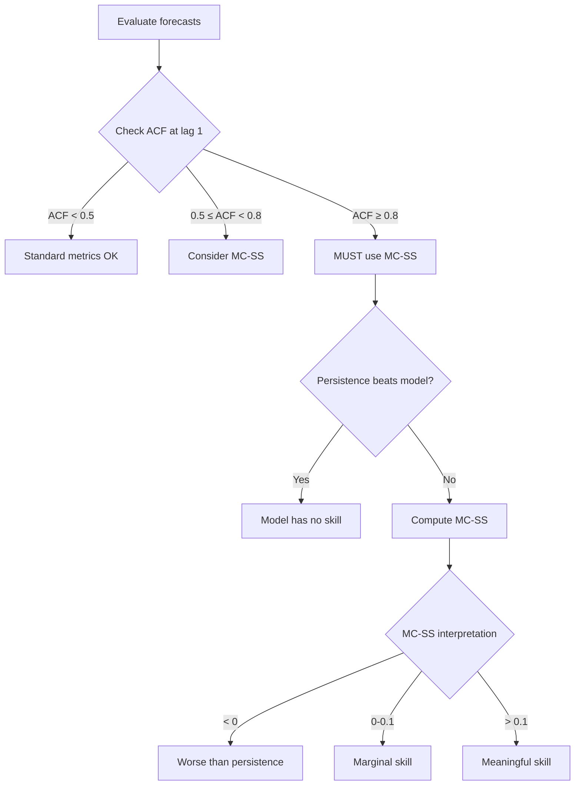

# API Reference: High-Persistence Metrics

Specialized tools for evaluating forecasts on high-persistence time series.

---

## When to Use



### Common Mistakes

- **Using MAE on near-unit-root data**
  - Persistence (predict no change) gets low MAE on sticky series
  - Model must beat persistence, not just have "good" MAE

- **Computing threshold on full dataset**
  - `compute_move_threshold()` must use training data only
  - Using test data leaks information about future volatility

- **Ignoring `is_reliable` flag**
  - MC-SS needs n_up ≥ 10 and n_down ≥ 10
  - Small sample sizes produce unreliable estimates

**See Also**: [High Persistence Tutorial](../tutorials/high_persistence.md), [Example 04](../tutorials/examples_index.md#04-high-persistence)

---

## Enums

### `MoveDirection`

Direction of value change.

| Value | Description |
|-------|-------------|
| `UP` | Value > threshold |
| `DOWN` | Value < -threshold |
| `FLAT` | \|Value\| ≤ threshold |

---

## Data Classes

### `MoveConditionalResult`

Move-conditional evaluation results.

```python
@dataclass
class MoveConditionalResult:
    mae_up: float           # MAE for upward moves
    mae_down: float         # MAE for downward moves
    mae_flat: float         # MAE for flat periods
    n_up: int               # Count of upward moves
    n_down: int             # Count of downward moves
    n_flat: int             # Count of flat periods
    skill_score: float      # MC-SS
    move_threshold: float   # Threshold used
```

**Properties**:

| Property | Type | Description |
|----------|------|-------------|
| `n_total` | `int` | Total sample count |
| `n_moves` | `int` | UP + DOWN count |
| `is_reliable` | `bool` | True if n_up ≥ 10 and n_down ≥ 10 |
| `move_fraction` | `float` | Fraction that are moves |

**Methods**:
- `to_dict() -> dict`: Convert to dictionary

---

## Functions

### `compute_move_threshold`

Compute move threshold from historical changes.

```python
def compute_move_threshold(
    actuals: np.ndarray,
    percentile: float = 70.0,
) -> float
```

**Parameters**:

| Parameter | Type | Default | Description |
|-----------|------|---------|-------------|
| `actuals` | `np.ndarray` | required | Historical changes (from training) |
| `percentile` | `float` | `70.0` | Percentile of \|actuals\| for threshold |

**Returns**: Move threshold

**CRITICAL**: Compute from training data only to prevent leakage.

**Example**:

```python
from temporalcv import compute_move_threshold

# Training data only!
threshold = compute_move_threshold(train_actuals, percentile=70)
print(f"Move threshold: {threshold:.4f}")
```

---

### `classify_moves`

Classify values into UP, DOWN, FLAT.

```python
def classify_moves(
    values: np.ndarray,
    threshold: float,
) -> np.ndarray
```

**Parameters**:

| Parameter | Type | Description |
|-----------|------|-------------|
| `values` | `np.ndarray` | Values to classify |
| `threshold` | `float` | Move threshold |

**Returns**: Array of `MoveDirection` enums

---

### `compute_move_conditional_metrics`

Compute move-conditional evaluation metrics.

```python
def compute_move_conditional_metrics(
    predictions: np.ndarray,
    actuals: np.ndarray,
    threshold: Optional[float] = None,
    threshold_percentile: float = 70.0,
) -> MoveConditionalResult
```

**Parameters**:

| Parameter | Type | Default | Description |
|-----------|------|---------|-------------|
| `predictions` | `np.ndarray` | required | Model predictions |
| `actuals` | `np.ndarray` | required | Actual values |
| `threshold` | `float` | `None` | Pre-computed threshold (recommended) |
| `threshold_percentile` | `float` | `70.0` | Percentile if computing from data |

**Returns**: `MoveConditionalResult`

**MC-SS Formula**:
```
MC-SS = 1 - (model_MAE_on_moves / persistence_MAE_on_moves)
```

**Example**:

```python
from temporalcv import compute_move_threshold, compute_move_conditional_metrics

# Compute threshold from training
threshold = compute_move_threshold(train_actuals)

# Evaluate on test
mc = compute_move_conditional_metrics(
    predictions=test_preds,
    actuals=test_actuals,
    threshold=threshold
)

print(f"MC-SS: {mc.skill_score:.3f}")
print(f"MAE on UP: {mc.mae_up:.4f} (n={mc.n_up})")
print(f"MAE on DOWN: {mc.mae_down:.4f} (n={mc.n_down})")
print(f"Reliable: {mc.is_reliable}")
```

---

### `compute_direction_accuracy`

Compute directional accuracy.

```python
def compute_direction_accuracy(
    predictions: np.ndarray,
    actuals: np.ndarray,
    move_threshold: Optional[float] = None,
) -> float
```

**Parameters**:

| Parameter | Type | Default | Description |
|-----------|------|---------|-------------|
| `predictions` | `np.ndarray` | required | Model predictions |
| `actuals` | `np.ndarray` | required | Actual values |
| `move_threshold` | `float` | `None` | Threshold for 3-class mode |

**Returns**: Direction accuracy (0-1)

**Modes**:

| Mode | Behavior |
|------|----------|
| 2-class (`threshold=None`) | Sign comparison, zeros excluded |
| 3-class (`threshold` provided) | UP/DOWN/FLAT, persistence gets credit for FLAT |

---

### `compute_move_only_mae`

Compute MAE only on moves (excluding FLAT).

```python
def compute_move_only_mae(
    predictions: np.ndarray,
    actuals: np.ndarray,
    threshold: float,
) -> Tuple[float, int]
```

**Parameters**:

| Parameter | Type | Description |
|-----------|------|-------------|
| `predictions` | `np.ndarray` | Model predictions |
| `actuals` | `np.ndarray` | Actual values |
| `threshold` | `float` | Move threshold |

**Returns**: `(mae, n_moves)` tuple

---

### `compute_persistence_mae`

Compute MAE of persistence baseline (predicts 0).

```python
def compute_persistence_mae(
    actuals: np.ndarray,
    threshold: Optional[float] = None,
) -> float
```

**Parameters**:

| Parameter | Type | Default | Description |
|-----------|------|---------|-------------|
| `actuals` | `np.ndarray` | required | Actual values |
| `threshold` | `float` | `None` | If provided, MAE on moves only |

**Returns**: Persistence MAE (= mean(\|actual\|))

---

## MC-SS Interpretation

| MC-SS Value | Meaning |
|-------------|---------|
| < 0 | Worse than persistence on moves |
| 0 | Same as persistence (no skill) |
| 0.1 - 0.2 | Modest skill on moves |
| > 0.2 | Strong skill (verify no leakage!) |
