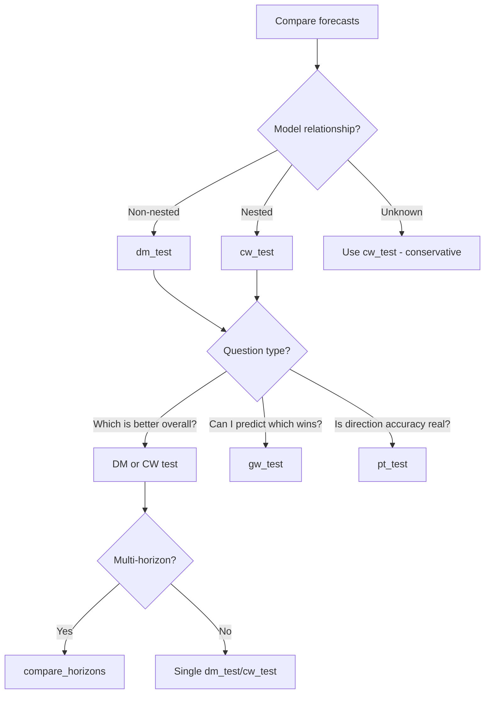

# API Reference: Statistical Tests

Statistical tests for forecast evaluation with proper corrections.

---

## When to Use



### Test Selection Guide

| Situation | Test | Reason |
|-----------|------|--------|
| RF vs XGBoost | `dm_test` | Non-nested models |
| AR(2) vs AR(1) | `cw_test` | Nested models |
| Full model vs subset | `cw_test` | Nested models |
| Model switching strategy | `gw_test` | Conditional predictive ability |
| Direction forecasting | `pt_test` | Tests sign/direction accuracy |

### Common Mistakes

- **Using DM test for nested models**
  - DM is biased when one model nests another
  - Example 18 shows Monte Carlo evidence of bias

- **Ignoring h in multi-step forecasts**
  - `dm_test(errors1, errors2, h=5)` for 5-step forecasts
  - HAC variance needs correct horizon for bandwidth

- **Comparing raw p-values across horizons**
  - Use `compare_horizons()` for consistent comparison
  - Accounts for sample size differences

**See Also**: [Example 03](../tutorials/examples_index.md#03-statistical-tests), [Example 13](../tutorials/examples_index.md#13-macro-gdp), [Example 18](../tutorials/examples_index.md#18-nested-dm-test-failure)

---

## Data Classes

### `DMTestResult`

Result from Diebold-Mariano test.

```python
@dataclass
class DMTestResult:
    statistic: float       # DM test statistic
    pvalue: float          # P-value for the test
    h: int                 # Forecast horizon used
    n: int                 # Number of observations
    loss: str              # Loss function ("squared" or "absolute")
    alternative: str       # Alternative hypothesis
    harvey_adjusted: bool  # Whether small-sample adjustment applied
    mean_loss_diff: float  # Mean loss differential
    variance_method: str   # Variance method ("hac" or "self_normalized")
```

**Note**: For `variance_method="hac"`, the statistic is asymptotically N(0,1). For `variance_method="self_normalized"`, the statistic has a non-standard distribution with critical values from simulation.

**Properties**:

| Property | Type | Description |
|----------|------|-------------|
| `significant_at_05` | `bool` | Is p-value < 0.05? |
| `significant_at_01` | `bool` | Is p-value < 0.01? |

**String representation**: `DM(h): statistic (p=pvalue)` with significance stars

---

### `PTTestResult`

Result from Pesaran-Timmermann test.

```python
@dataclass
class PTTestResult:
    statistic: float    # PT test statistic (z-score)
    pvalue: float       # P-value (one-sided)
    accuracy: float     # Observed directional accuracy
    expected: float     # Expected accuracy under null
    n: int              # Number of observations
    n_classes: int      # Number of direction classes (2 or 3)
```

**Properties**:

| Property | Type | Description |
|----------|------|-------------|
| `significant_at_05` | `bool` | Is p-value < 0.05? |
| `skill` | `float` | accuracy - expected |

**String representation**: `PT: accuracy vs expected (z=statistic, p=pvalue)`

---

### `GWTestResult`

Result from Giacomini-White test for conditional predictive ability.

```python
@dataclass
class GWTestResult:
    statistic: float       # GW test statistic (T × R²)
    pvalue: float          # P-value from χ²(q)
    r_squared: float       # R² from auxiliary regression
    n: int                 # Effective sample size
    n_lags: int            # Number of lags (τ)
    q: int                 # Degrees of freedom (1 + n_lags)
    loss: str              # Loss function ("squared" or "absolute")
    alternative: str       # Alternative hypothesis
    mean_loss_diff: float  # Mean loss differential
```

**Properties**:

| Property | Type | Description |
|----------|------|-------------|
| `significant_at_05` | `bool` | Is p-value < 0.05? |
| `significant_at_01` | `bool` | Is p-value < 0.01? |
| `conditional_predictability` | `bool` | Alias for `significant_at_05` |

**String representation**: `GW(τ): statistic (p=pvalue, R²=value)` with significance stars

**Key Distinction from DM Test**:

| Test | Tests | Question |
|------|-------|----------|
| DM | Unconditional predictive ability | "Which model is better *on average*?" |
| GW | Conditional predictive ability | "Can we *predict* which model will win given recent performance?" |

---

### `CWTestResult`

Result from Clark-West test for nested model comparison.

The CW test adjusts the DM test for the bias caused by estimating extra parameters in the unrestricted model that have true value zero. This bias makes the unrestricted model appear worse than it truly is.

**Attributes:**

| Attribute | Type | Description |
|-----------|------|-------------|
| `statistic` | `float` | CW test statistic (asymptotically N(0,1)) |
| `pvalue` | `float` | P-value for the test |
| `h` | `int` | Forecast horizon used |
| `n` | `int` | Number of observations |
| `loss` | `str` | Loss function ("squared" or "absolute") |
| `alternative` | `str` | Alternative hypothesis |
| `harvey_adjusted` | `bool` | Whether Harvey correction was applied |
| `mean_loss_diff` | `float` | Mean unadjusted loss differential E[d_t] |
| `mean_loss_diff_adjusted` | `float` | Mean adjusted loss differential E[d*_t] |
| `adjustment_magnitude` | `float` | Mean of (ŷ_r - ŷ_u)² — noise removed |
| `variance_method` | `str` | "hac" or "self_normalized" |

**Properties:**

| Property | Returns | Description |
|----------|---------|-------------|
| `significant_at_05` | `bool` | P-value < 0.05 |
| `significant_at_01` | `bool` | P-value < 0.01 |
| `adjustment_ratio` | `float` | Ratio of adjustment to unadjusted loss diff |

**Example:**

```python
>>> result = cw_test(ar2_errors, ar1_errors, ar2_preds, ar1_preds)
>>> print(f"CW: {result.statistic:.3f} (p={result.pvalue:.4f})")
>>> print(f"Adjustment magnitude: {result.adjustment_magnitude:.4f}")
>>> print(f"Adjustment ratio: {result.adjustment_ratio:.2%}")
```

**When to use CW vs DM:**

| Situation | Test |
|-----------|------|
| Non-nested models (ARIMA vs Random Forest) | `dm_test()` |
| Nested models (AR(2) vs AR(1), Full vs Reduced) | `cw_test()` |

---

## Functions

### `dm_test`

Diebold-Mariano test for equal predictive accuracy.

```python
def dm_test(
    errors_1: np.ndarray,
    errors_2: np.ndarray,
    h: int = 1,
    loss: Literal["squared", "absolute"] = "squared",
    alternative: Literal["two-sided", "less", "greater"] = "two-sided",
    harvey_correction: bool = True,
    variance_method: Literal["hac", "self_normalized"] = "hac",
) -> DMTestResult
```

**Parameters**:

| Parameter | Type | Default | Description |
|-----------|------|---------|-------------|
| `errors_1` | `np.ndarray` | required | Errors from model 1 (`actual - prediction`) |
| `errors_2` | `np.ndarray` | required | Errors from model 2 (baseline) |
| `h` | `int` | `1` | Forecast horizon |
| `loss` | `str` | `"squared"` | Loss function: `"squared"` or `"absolute"` |
| `alternative` | `str` | `"two-sided"` | `"two-sided"`, `"less"`, or `"greater"` |
| `harvey_correction` | `bool` | `True` | Apply small-sample adjustment (HAC only) |
| `variance_method` | `str` | `"hac"` | `"hac"` or `"self_normalized"` |

**Returns**: `DMTestResult`

**Raises**: `ValueError` if fewer than 30 samples

**Alternative hypotheses**:
- `"two-sided"`: Models have different accuracy
- `"less"`: Model 1 more accurate (lower loss)
- `"greater"`: Model 2 more accurate

**Variance methods**:

| Method | Pros | Cons | When to Use |
|--------|------|------|-------------|
| `"hac"` | Higher power | Requires bandwidth selection, can be negative | Default, well-tuned bandwidth |
| `"self_normalized"` | No bandwidth, always positive, robust | Slightly lower power | Uncertain bandwidth, small samples |

**Example**:

```python
from temporalcv import dm_test

# Compute errors: actual - predicted
model_errors = actuals - model_preds
persistence_errors = actuals - 0  # Persistence predicts 0

result = dm_test(
    errors_1=model_errors,
    errors_2=persistence_errors,
    h=2,
    loss="absolute",
    alternative="less"  # Test if model 1 is better
)

print(f"DM statistic: {result.statistic:.3f}")
print(f"p-value: {result.pvalue:.4f}")
print(f"Significant: {result.significant_at_05}")

# Using self-normalized variance for robustness
result_sn = dm_test(
    errors_1=model_errors,
    errors_2=persistence_errors,
    variance_method="self_normalized"
)
print(f"Self-normalized: {result_sn.pvalue:.4f}")
```

---

### `pt_test`

Pesaran-Timmermann test for directional accuracy.

```python
def pt_test(
    actual: np.ndarray,
    predicted: np.ndarray,
    move_threshold: Optional[float] = None,
) -> PTTestResult
```

**Parameters**:

| Parameter | Type | Default | Description |
|-----------|------|---------|-------------|
| `actual` | `np.ndarray` | required | Actual values (changes) |
| `predicted` | `np.ndarray` | required | Predicted values (changes) |
| `move_threshold` | `float` | `None` | Threshold for 3-class mode |

**Returns**: `PTTestResult`

**Raises**: `ValueError` if fewer than 20 samples

**Modes**:

| Mode | Condition | Classes |
|------|-----------|---------|
| 2-class | `move_threshold=None` | Positive/Negative sign |
| 3-class | `move_threshold` provided | UP/DOWN/FLAT |

**Example**:

```python
from temporalcv import pt_test, compute_move_threshold

# Compute threshold from training data
threshold = compute_move_threshold(train_actuals, percentile=70)

# Test directional accuracy with 3-class
result = pt_test(
    actual=test_actuals,
    predicted=test_preds,
    move_threshold=threshold
)

print(f"Direction accuracy: {result.accuracy:.1%}")
print(f"Expected (random): {result.expected:.1%}")
print(f"Skill: {result.skill:.1%}")
print(f"Significant: {result.significant_at_05}")
```

**Warning**: For h>1 step forecasts, p-values may be optimistic (no HAC correction). Use DM test for rigorous multi-step testing.

---

### `gw_test`

Giacomini-White test for conditional predictive ability.

```python
def gw_test(
    errors_1: np.ndarray,
    errors_2: np.ndarray,
    n_lags: int = 1,
    loss: Literal["squared", "absolute"] = "squared",
    alternative: Literal["two-sided", "less", "greater"] = "two-sided",
) -> GWTestResult
```

**Parameters**:

| Parameter | Type | Default | Description |
|-----------|------|---------|-------------|
| `errors_1` | `np.ndarray` | required | Errors from model 1 (`actual - prediction`) |
| `errors_2` | `np.ndarray` | required | Errors from model 2 (baseline) |
| `n_lags` | `int` | `1` | Lags in conditioning set (1-10) |
| `loss` | `str` | `"squared"` | Loss function: `"squared"` or `"absolute"` |
| `alternative` | `str` | `"two-sided"` | `"two-sided"`, `"less"`, or `"greater"` |

**Returns**: `GWTestResult`

**Raises**: `ValueError` if fewer than 50 effective samples (after lag adjustment)

**Alternative hypotheses**:
- `"two-sided"`: Conditional predictive ability differs
- `"less"`: Model 1 conditionally better (lower loss given past)
- `"greater"`: Model 2 conditionally better

**Interpretation Table**:

| DM Result | GW Result | Interpretation |
|-----------|-----------|----------------|
| Not sig | Not sig | No difference in predictive ability |
| Sig | Sig | Model unconditionally and conditionally better |
| Sig | Not sig | Better on average, but not predictably |
| Not sig | **Sig** | **Equal average, but performance is predictable!** |

**Example**:

```python
from temporalcv import dm_test, gw_test

# Run both tests for comprehensive comparison
dm_result = dm_test(model_errors, baseline_errors)
gw_result = gw_test(model_errors, baseline_errors, n_lags=1)

# Key insight: check if conditional predictability exists
if gw_result.conditional_predictability:
    print(f"Past performance predicts future superiority!")
    print(f"R-squared: {gw_result.r_squared:.3f}")

    # Models may have equal average accuracy but...
    if not dm_result.significant_at_05:
        print("Equal average accuracy, but switching could help!")

# Using multiple lags
gw_result_3lag = gw_test(model_errors, baseline_errors, n_lags=3)
print(f"3-lag R²: {gw_result_3lag.r_squared:.3f}")
```

**When to Use GW vs DM**:

| Use Case | Recommended Test |
|----------|------------------|
| Which model is better overall? | DM test |
| Should I switch between models? | GW test |
| Comprehensive comparison | Both |
| Model selection for production | DM test |
| Dynamic model switching strategy | GW test |

---

### `cw_test`

Clark-West test for nested model comparison.

The CW test adjusts the DM test for the bias caused by estimating extra parameters with true value zero. Use this when comparing nested models (e.g., AR(2) vs AR(1), Full vs Reduced).

```python
def cw_test(
    errors_unrestricted: np.ndarray,
    errors_restricted: np.ndarray,
    predictions_unrestricted: np.ndarray,
    predictions_restricted: np.ndarray,
    h: int = 1,
    loss: Literal["squared", "absolute"] = "squared",
    alternative: Literal["two-sided", "less", "greater"] = "two-sided",
    harvey_correction: bool = True,
    variance_method: Literal["hac", "self_normalized"] = "hac",
) -> CWTestResult
```

**Parameters**:

| Parameter | Type | Default | Description |
|-----------|------|---------|-------------|
| `errors_unrestricted` | `np.ndarray` | required | Errors from unrestricted model (more params) |
| `errors_restricted` | `np.ndarray` | required | Errors from restricted model (nested) |
| `predictions_unrestricted` | `np.ndarray` | required | Forecasts from unrestricted model |
| `predictions_restricted` | `np.ndarray` | required | Forecasts from restricted model |
| `h` | `int` | `1` | Forecast horizon |
| `loss` | `str` | `"squared"` | Loss function |
| `alternative` | `str` | `"two-sided"` | Alternative hypothesis |
| `harvey_correction` | `bool` | `True` | Small-sample adjustment |
| `variance_method` | `str` | `"hac"` | Variance estimation method |

**Returns**: `CWTestResult`

**The CW Adjustment**:

```
d*_t = d_t - (ŷ_restricted - ŷ_unrestricted)²
```

The term `(ŷ_r - ŷ_u)²` captures the noise cost of estimating extra parameters with true value zero.

**Example: Comparing AR(2) vs AR(1)**:

```python
from temporalcv import cw_test, dm_test
import numpy as np

# AR(2) is unrestricted, AR(1) is restricted (nested)
result = cw_test(
    errors_unrestricted=ar2_errors,
    errors_restricted=ar1_errors,
    predictions_unrestricted=ar2_preds,
    predictions_restricted=ar1_preds,
    alternative="less",  # Test if AR(2) is better
)

print(f"CW statistic: {result.statistic:.3f}")
print(f"P-value: {result.pvalue:.4f}")
print(f"Adjustment: {result.adjustment_magnitude:.4f}")

# Compare with DM test to see bias
dm_result = dm_test(ar2_errors, ar1_errors, alternative="less")
print(f"DM p-value: {dm_result.pvalue:.4f} (may be biased for nested models)")
print(f"CW p-value: {result.pvalue:.4f} (corrected)")
```

**Key Insight**: When predictions are identical (zero adjustment), CW equals DM. For nested models with extra parameters, CW removes the bias that makes the unrestricted model appear worse.

**Reference**: Clark, T.E. & West, K.D. (2007). *Approximately normal tests for equal predictive accuracy in nested models*. Journal of Econometrics 138(1), 291-311.

---

### `compute_hac_variance`

Compute HAC (Heteroskedasticity and Autocorrelation Consistent) variance.

```python
def compute_hac_variance(
    d: np.ndarray,
    bandwidth: Optional[int] = None,
) -> float
```

**Parameters**:

| Parameter | Type | Default | Description |
|-----------|------|---------|-------------|
| `d` | `np.ndarray` | required | Series (typically loss differential) |
| `bandwidth` | `int` | `None` | Kernel bandwidth. If None, auto-selected. |

**Returns**: HAC variance estimate

**Notes**:
- Uses Newey-West estimator with Bartlett kernel
- For h-step forecasts: `bandwidth = h - 1` is appropriate
- Automatic bandwidth: `floor(4 * (n/100)^(2/9))`

---

### `compute_self_normalized_variance`

Compute self-normalized variance using partial sums [T1].

```python
def compute_self_normalized_variance(d: np.ndarray) -> float
```

**Parameters**:

| Parameter | Type | Default | Description |
|-----------|------|---------|-------------|
| `d` | `np.ndarray` | required | Series (typically loss differential) |

**Returns**: Self-normalized variance estimate (always >= 0)

**Notes**:
- Uses partial sums: `S_k = cumsum(d - mean(d))`
- Formula: `V_n = (1/n²) * sum(S_k²)`
- Cannot produce negative variance (unlike HAC)
- No bandwidth selection required

**Advantages over HAC**:
- ✓ No bandwidth selection required
- ✓ Cannot produce negative variance
- ✓ Better size control in small samples
- ✗ Slightly lower power than well-tuned HAC

---

## Multi-Horizon Comparison

### `MultiHorizonResult`

Result from comparing two models across multiple forecast horizons.

```python
@dataclass(frozen=True)
class MultiHorizonResult:
    horizons: Tuple[int, ...]              # Forecast horizons tested
    dm_results: Dict[int, DMTestResult]    # h -> DM test result
    model_1_name: str                      # Name of model 1
    model_2_name: str                      # Name of model 2
    n_per_horizon: Dict[int, int]          # Sample size per horizon
    loss: str                              # Loss function used
    alternative: str                       # Alternative hypothesis
    alpha: float                           # Significance level
```

**Properties**:

| Property | Type | Description |
|----------|------|-------------|
| `significant_horizons` | `List[int]` | Horizons where p < alpha |
| `first_insignificant_horizon` | `Optional[int]` | First h where significance is lost |
| `best_horizon` | `int` | Horizon with smallest p-value |
| `degradation_pattern` | `str` | "consistent" \| "degrading" \| "none" \| "irregular" |

**Methods**:

| Method | Returns | Description |
|--------|---------|-------------|
| `get_pvalues()` | `Dict[int, float]` | P-values for each horizon |
| `get_statistics()` | `Dict[int, float]` | DM statistics for each horizon |
| `summary()` | `str` | Human-readable summary |
| `to_markdown()` | `str` | Markdown table format |

---

### `compare_horizons`

Compare two models across multiple forecast horizons using DM tests.

```python
def compare_horizons(
    errors_1: np.ndarray,
    errors_2: np.ndarray,
    horizons: Sequence[int] = (1, 2, 3, 4),
    *,
    loss: Literal["squared", "absolute"] = "squared",
    alternative: Literal["two-sided", "less", "greater"] = "two-sided",
    alpha: float = 0.05,
    harvey_correction: bool = True,
    variance_method: Literal["hac", "self_normalized"] = "hac",
    model_1_name: str = "Model",
    model_2_name: str = "Baseline",
) -> MultiHorizonResult
```

**Parameters**:

| Parameter | Type | Default | Description |
|-----------|------|---------|-------------|
| `errors_1` | `np.ndarray` | required | Errors from model 1 (candidate) |
| `errors_2` | `np.ndarray` | required | Errors from model 2 (baseline) |
| `horizons` | `Sequence[int]` | `(1, 2, 3, 4)` | Forecast horizons to test |
| `loss` | `str` | `"squared"` | Loss function for DM test |
| `alternative` | `str` | `"two-sided"` | Alternative hypothesis |
| `alpha` | `float` | `0.05` | Significance level |
| `harvey_correction` | `bool` | `True` | Apply small-sample adjustment |
| `variance_method` | `str` | `"hac"` | Variance estimation method |
| `model_1_name` | `str` | `"Model"` | Name for model 1 |
| `model_2_name` | `str` | `"Baseline"` | Name for model 2 |

**Returns**: `MultiHorizonResult`

**Example**:

```python
from temporalcv import compare_horizons

# Compare model to baseline across horizons
result = compare_horizons(
    model_errors, baseline_errors,
    horizons=(1, 2, 4, 8, 12),
    alternative="less",  # Test if model is better
)

print(result.significant_horizons)      # [1, 2, 4]
print(result.first_insignificant_horizon)  # 8
print(result.degradation_pattern)       # "degrading"

# Print results table
print(result.to_markdown())
```

**Degradation Patterns**:

| Pattern | Definition |
|---------|------------|
| `consistent` | All horizons significant OR all insignificant |
| `degrading` | P-values increase with horizon (advantage fades) |
| `none` | No significant horizons |
| `irregular` | Non-monotonic pattern (>1 violation) |

---

### `MultiModelHorizonResult`

Result from comparing multiple models across multiple horizons.

```python
@dataclass(frozen=True)
class MultiModelHorizonResult:
    horizons: Tuple[int, ...]                           # Horizons tested
    model_names: Tuple[str, ...]                        # Model names
    pairwise_by_horizon: Dict[int, MultiModelComparisonResult]  # h -> comparison
    alpha: float                                        # Significance level
```

**Properties**:

| Property | Type | Description |
|----------|------|-------------|
| `best_model_by_horizon` | `Dict[int, str]` | Best model at each horizon |
| `consistent_best` | `Optional[str]` | Model winning all horizons, or None |

---

### `compare_models_horizons`

Compare multiple models across multiple horizons.

```python
def compare_models_horizons(
    errors_dict: Dict[str, np.ndarray],
    horizons: Sequence[int] = (1, 2, 3, 4),
    *,
    loss: Literal["squared", "absolute"] = "squared",
    alpha: float = 0.05,
    harvey_correction: bool = True,
) -> MultiModelHorizonResult
```

**Parameters**:

| Parameter | Type | Default | Description |
|-----------|------|---------|-------------|
| `errors_dict` | `Dict[str, np.ndarray]` | required | Model name → error array |
| `horizons` | `Sequence[int]` | `(1, 2, 3, 4)` | Forecast horizons to test |
| `loss` | `str` | `"squared"` | Loss function |
| `alpha` | `float` | `0.05` | Significance level |
| `harvey_correction` | `bool` | `True` | Apply small-sample adjustment |

**Returns**: `MultiModelHorizonResult`

**Example**:

```python
from temporalcv import compare_models_horizons

# Compare multiple models across horizons
result = compare_models_horizons(
    {"ARIMA": arima_errors, "RF": rf_errors, "Naive": naive_errors},
    horizons=(1, 4, 12),
)

# Check if one model consistently wins
if result.consistent_best:
    print(f"Consistent winner: {result.consistent_best}")
else:
    print("Best model varies by horizon:")
    for h, model in result.best_model_by_horizon.items():
        print(f"  h={h}: {model}")
```

---

## References

**[T1] Core Statistical Methods**:

- Diebold, F.X. & Mariano, R.S. (1995). "Comparing Predictive Accuracy." *Journal of Business & Economic Statistics*, 13(3), 253-263. [DOI: 10.1080/07350015.1995.10524599](https://doi.org/10.1080/07350015.1995.10524599)

- Harvey, D., Leybourne, S., & Newbold, P. (1997). "Testing the Equality of Prediction Mean Squared Errors." *International Journal of Forecasting*, 13(2), 281-291. [DOI: 10.1016/S0169-2070(96)00719-4](https://doi.org/10.1016/S0169-2070(96)00719-4)

- Pesaran, M.H. & Timmermann, A. (1992). "A Simple Nonparametric Test of Predictive Performance." *Journal of Business & Economic Statistics*, 10(4), 461-465. [DOI: 10.1080/07350015.1992.10509922](https://doi.org/10.1080/07350015.1992.10509922)

- Newey, W.K. & West, K.D. (1987). "A Simple, Positive Semi-definite, Heteroskedasticity and Autocorrelation Consistent Covariance Matrix." *Econometrica*, 55(3), 703-708. [DOI: 10.2307/1913610](https://doi.org/10.2307/1913610)

- Shao, X. (2010). "A Self-Normalized Approach to Confidence Interval Construction in Time Series." *Journal of the Royal Statistical Society: Series B*, 72(3), 343-366. [DOI: 10.1111/j.1467-9868.2009.00737.x](https://doi.org/10.1111/j.1467-9868.2009.00737.x)

- Lobato, I.N. (2001). "Testing That a Dependent Process Is Uncorrelated." *Journal of the American Statistical Association*, 96(453), 169-176. [DOI: 10.1198/016214501750333073](https://doi.org/10.1198/016214501750333073)

- Giacomini, R. & White, H. (2006). "Tests of Conditional Predictive Ability." *Econometrica*, 74(6), 1545-1578. [DOI: 10.1111/j.1468-0262.2006.00718.x](https://doi.org/10.1111/j.1468-0262.2006.00718.x)
